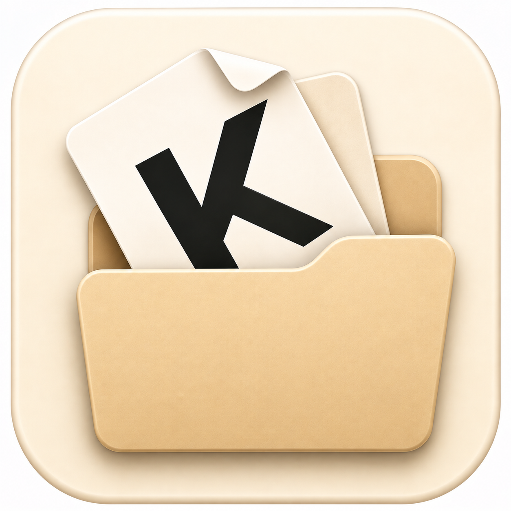

# Keeper - Manuals & More

  

  <strong>Find manuals faster. Keep anything that matters.</strong>

  Scan a product model number with OCR, search for its manual, and Keeper it. 
  Manuals are only the beginning — PDFs, URLs, photos, notes, recipes, travel information, work references, and more can all be organized in one place.

  
  

  <strong>Available on Google Play and the App Store.</strong>

---

## 🔎 Scan. Search. Keeper.

One of Keeper's core features is its OCR-assisted manual search workflow.

Instead of manually typing a long product model number:

**Take a photo → Detect the model number with OCR → Search for manuals → Choose one → Keeper it.**

Keeper helps reduce the friction of finding a manual when you need it.

But Keeper is **not just a manual app**.

It is designed as a personal place for keeping the information you do not want to lose.

Manuals, PDFs, URLs, photos, notes, recipes, travel information, work references, hobby collections — organize them your way and find them again when you need them.

---

## About Keeper

Keeper is a local-first Flutter application for organizing important personal information in one place.

Information that would normally be scattered across browser bookmarks, photo libraries, PDF folders, cloud storage, and note apps can be organized together inside Keeper.

Keeper is built around a simple idea:

> **You choose what matters. Keeper keeps it.**

Search and assistance features can help users find information, but the final choice always belongs to the user.

The project was independently designed, developed, tested, and released as a production application for both Android and iOS.

---

## Features

- 📸 Capture product model numbers with OCR
- 🔎 Search for manuals using detected model numbers
- 📄 Store and manage PDF manuals and other PDF files
- 🔗 Save useful URLs
- 📝 Keep personal notes
- 🖼 Store photos with your information
- 🗂 Organize information by category
- 🔍 Search stored information quickly
- 📌 Pin important items
- ↕️ Reorder and manage cards
- 🔒 Face ID / Touch ID / Fingerprint authentication
- ☁️ Google Drive backup on Android
- ☁️ iCloud backup on iOS
- 🎨 Light, dark, and customizable display themes
- 🔊 Optional Keeper success sound with silent-mode awareness

---

## OCR Manual Search

Keeper includes an OCR-assisted workflow designed to make finding product manuals easier.

Users can photograph a product label or model number. Keeper extracts text from the image and helps identify the model number without requiring manual entry.

The detected model number can then be used to search for manual candidates.

The user reviews the results, chooses the appropriate manual, and decides whether to Keeper it.

The captured OCR image is used for recognition and is not automatically stored as a registered product image.

The workflow keeps the user in control:

**Keeper helps find it. You choose it. Keeper stores it.**

---

## More Than Manuals

Manual search is one of Keeper's main features, but Keeper is intentionally designed to be flexible.

Keeper can also be used for:

- 🍳 Recipes and cooking references
- ✈️ Travel plans and useful travel information
- 💼 Work documents and reference material
- 🎨 Hobby information and collections
- 📑 PDFs you want to find again
- 🔗 Useful websites and resources
- 📷 Photos with related notes
- 📝 Personal memos and records

There is no fixed definition of what belongs in Keeper.

**You decide what matters.**

---

## Local-First Design

Keeper is designed around local data ownership.

Core information is stored on the device, while platform-specific backup options are available for users who want to protect or transfer their Keeper data.

- **Android:** Google Drive backup
- **iOS:** iCloud backup

This allows Keeper to remain useful without requiring users to store their personal collection in a dedicated Keeper cloud service.

---

## Security

Keeper supports device-native authentication where available.

- Face ID
- Touch ID
- Fingerprint authentication

Users can protect the information stored in Keeper using the security features already provided by their device.

---

## Download

### Android

Keeper v1.0.1 is available on Google Play.

[Get Keeper on Google Play](https://play.google.com/store/apps/details?id=com.seiko.keeper)

### iOS

Keeper v1.0.1 is available on the App Store.

[View Keeper - Manuals & More on the App Store](https://apps.apple.com/app/keeper-manuals-more/id6797875211)

---

## Technology

Keeper is built with **Flutter and Dart**.

The project includes practical implementations of:

- Flutter cross-platform application development
- Local database management
- PDF and file handling
- OCR / text recognition
- Manual search workflows
- Native biometric authentication
- Platform-specific cloud backup
- Mobile advertising integration
- Android and iOS platform integration
- App Store release workflows
- Google Play production release workflows

---

## Development Approach

Keeper was developed from initial requirements through production release as an independent mobile application project.

The development process includes:

1. Requirements definition
2. UX / UI design
3. Architecture and implementation
4. AI-assisted development and code review
5. Android and iOS device testing
6. Regression testing
7. Store preparation and compliance
8. App Store and Google Play deployment
9. Continuous UX improvement based on real-device testing

The project demonstrates an end-to-end product development workflow:

**Idea → Requirements → UX → Implementation → Testing → Store Release → Improvement**

Keeper is not presented simply as a coding exercise.

It demonstrates the ability to take a product idea from **0 → 1**, make product and UX decisions, implement the application, handle platform-specific requirements, and deliver a working mobile product to real users on both major mobile platforms.

---

## Privacy

Keeper's privacy information is published in Japanese and English.

See the Keeper website for details about:

- Data handling
- Device permissions
- Advertising
- OCR
- Backup functionality
- Platform-specific services

---

## Website

Keeper product information, features, privacy policy, terms, downloads, and support:

**https://seiko-k.github.io/Keeper/**

---

## Contact

For inquiries, feedback, or support:

**https://forms.gle/PYEoVw6iZAjhQ6Jw5**

---

## Release Status

| Platform | Version | Status |
| --- | --- | --- |
| Android | **v1.0.1** | 🟢 Available on Google Play |
| iOS | **v1.0.1** | 🟢 Available on the App Store |

---

## Project Status

Keeper is actively maintained.

Future development will continue to improve:

- OCR model-number recognition
- Manual search
- Search accuracy
- Usability
- Platform integration
- Personal information organization

---

  <strong>Find it. Choose it. Keeper it.</strong>

  © 2026 Keeper

